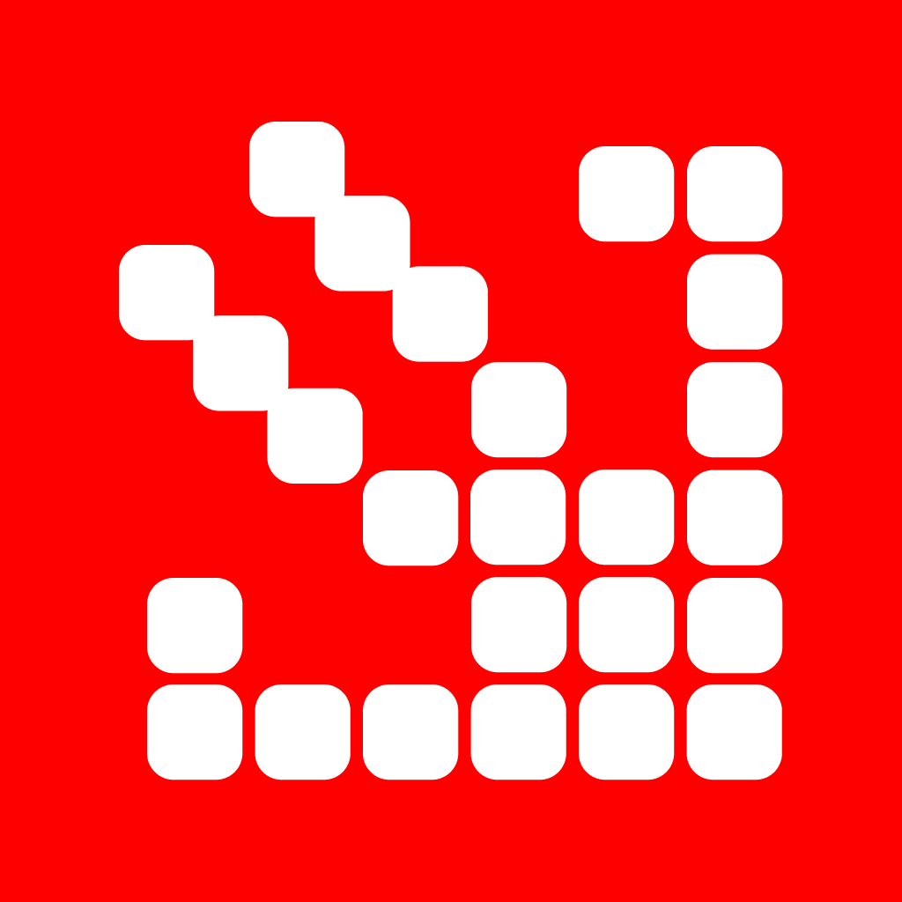

<div align="center">
  <a href="https://swiftpieces.com">
    
  </a>
</div>

<div align="center">

**An open-source library of animated SwiftUI components.**


[**swiftpieces.com**](https://swiftpieces.com) &nbsp;&middot;&nbsp; [Components](https://swiftpieces.com/components) &nbsp;&middot;&nbsp; [Docs](https://swiftpieces.com/docs/introduction) &nbsp;&middot;&nbsp; [Follow on X](https://x.com/saivion)

</div>

<br />

Swift Pieces is a library of designed SwiftUI interactions: swipe decks, glass menus, floating docks, scrubbable charts. Not primitives, and not a dependency. Each piece is a single `.swift` file with a `#Preview`, built on Apple frameworks only, that you copy into your project and own outright. Motion, haptics and states are already done.

## Quick start

Add any piece with the CLI:

```bash
npx swiftpieces add AssistantOrb
```

Several at once:

```bash
npx swiftpieces add AssistantOrb SwipeDeck GlassActionMenu
```

Or open the file on [swiftpieces.com/components](https://swiftpieces.com/components) and copy it. There is nothing to install and no package to track.

**55 pieces across 14 categories:** [text](https://swiftpieces.com/components/text), [backgrounds](https://swiftpieces.com/components/backgrounds), [Liquid Glass](https://swiftpieces.com/components/glass), [buttons and controls](https://swiftpieces.com/components/controls), [inputs and forms](https://swiftpieces.com/components/inputs), [cards](https://swiftpieces.com/components/cards), [lists](https://swiftpieces.com/components/lists), [navigation](https://swiftpieces.com/components/navigation), [sheets](https://swiftpieces.com/components/sheets), [feedback](https://swiftpieces.com/components/feedback), [motion](https://swiftpieces.com/components/motion), [data and charts](https://swiftpieces.com/components/data), [AI](https://swiftpieces.com/components/ai) and [media](https://swiftpieces.com/components/media).

**Guides:** [SwiftUI animations](https://swiftpieces.com/docs/guides/swiftui-animations) · [SwiftUI buttons](https://swiftpieces.com/docs/guides/swiftui-buttons) · [SwiftUI cards](https://swiftpieces.com/docs/guides/swiftui-cards) · [SwiftUI haptics](https://swiftpieces.com/docs/guides/swiftui-haptics) · [Loading states](https://swiftpieces.com/docs/guides/swiftui-loading-states) · [Liquid Glass](https://swiftpieces.com/docs/liquid-glass)

## What you get

- **iOS 17 baseline.** Liquid Glass effects are gated behind `#available(iOS 26, *)` with a Material fallback, so a piece never fails to build on an older SDK.
- **Apple frameworks only.** No third-party dependencies, ever. A `.metal` sibling ships alongside the `.swift` file where a shader is involved.
- **Accessible by default.** Reduce Motion and Reduce Transparency are respected, colors are semantic, and Dynamic Type works.
- **Documented parameters.** Every init parameter carries a doc comment, which becomes the parameters table on the site.
- **Type-checked in CI.** Every piece is compiled against the iOS simulator SDK on every change, so an API that does not exist cannot land.

## Sponsors

Swift Pieces is maintained by one developer and funded by its sponsors. Sponsorship pays for new free pieces, fixes for every iOS release, and the docs, CLI and MCP server.

**[Become a sponsor](https://swiftpieces.com/sponsors)** from $5 a month. Company tiers put your logo on swiftpieces.com, the docs and this README.

<!-- sponsors: Gold and Bronze-and-up logos are added here by hand; the live list is on swiftpieces.com/sponsors -->

## Swift Pieces Pro

The free library is the pieces. **[Pro](https://pro.swiftpieces.com)** is the layer above them: production-ready screens, complete app templates, and the Build Kit, a set of agent skills that build the rest of your app in the same design language. One purchase, lifetime access.

Pro is closed source and lives in a private repository. This repo holds the free library and the site, and it stays that way.

## Running locally

```bash
git clone https://github.com/Saivion/SwiftPieces.git
cd SwiftPieces
npm install
npm run brand:build      # @swiftpieces/brand -> dist (first run only)
npm run registry:build   # .swift -> registry JSON, docs pages, llms.txt
npm run dev
```

Node 22 is what CI uses. Pieces live in `registry/swift/<category>/`; after changing one, or `registry.json`, rerun `npm run registry:build` to regenerate the registry output.

| Path | Purpose |
| --- | --- |
| `registry/swift/<category>/` | **Source of truth.** One `.swift` per piece with a `// swiftpieces:` header; `.metal` siblings for shaders. |
| `registry/__registry__/` | Generated registry JSON. Do not hand-edit. |
| `content/docs/` | Fumadocs content. Per-piece pages are generated. |
| `app/` | Next.js App Router: marketing, docs, `/api/registry/[name]`, `/api/mcp`, search. |
| `components/previews/` | Web recreations of the pieces, used for live previews. |
| `packages/cli/` | [`swiftpieces`](https://www.npmjs.com/package/swiftpieces) on npm: `init`, `add`, `list`, `login`, `whoami`. |
| `packages/brand/` | [`@swiftpieces/brand`](https://www.npmjs.com/package/@swiftpieces/brand) on npm: tokens, Tailwind theme, shared primitives. |
| `previews/` | Xcode preview harness and recorder. |
| `scripts/` | Registry build, Swift type-check, preview recorder, bundle gate, public-safety audit. |

Useful checks, all of which CI runs too:

```bash
npm run typecheck        # TypeScript
npm run swift:typecheck  # every piece against the iOS simulator SDK
npm run bundle:check     # the Worker must stay under 8 MB compressed
npm run audit:public     # nothing Pro-shaped, nothing secret
```

<details>
<summary><b>Deployment and analytics</b> (maintainers)</summary>

<br />

swiftpieces.com deploys from GitHub with **Cloudflare Workers Builds**. Nothing is deployed from a laptop.

| Branch | What happens |
| --- | --- |
| `main` | Builds and deploys to production (swiftpieces.com). |
| any other branch / PR | Builds a preview version with its own URL. Production is untouched. |

GitHub Actions is here for **safety only**, because this repo is public and takes contributions. `ci.yml` checks every push and PR for leaked secrets, Pro-only code, a stale registry, type errors and bundle size. `swift.yml` type-checks every piece against the iOS SDK, and runs only when Swift, Metal or the preview app changes. Actions never deploys and holds no Cloudflare credentials; Cloudflare does the deploying.

**Workers Builds settings** (Cloudflare dashboard → Workers → `swiftpieces` → Settings → Build):

| Setting | Value |
| --- | --- |
| Git repository | this repo, production branch `main` |
| Build command | `npm run cf:build` |
| Deploy command | `npx opennextjs-cloudflare deploy` |
| Non-production branch deploy command | `npx opennextjs-cloudflare upload` |
| Builds for non-production branches | on |
| Build variables | `NODE_VERSION` = `22`, `NEXT_PUBLIC_CF_BEACON_TOKEN` = the Web Analytics token (optional) |

Build variables are read while building, not by the running Worker. The analytics token is only baked into `main` builds, so preview URLs never count toward the numbers.

**Analytics (swiftpieces.com only).** The official deploy counts page views with Cloudflare Web Analytics and shows the all-time visit count under the hero. Forks and local builds leave these unset, so no beacon loads and the visit line never renders. There are no secrets to configure to run this project.

| Variable | Where | What |
| --- | --- | --- |
| `NEXT_PUBLIC_CF_BEACON_TOKEN` | `.env.production` | The Web Analytics beacon token. Public by design; inlined at build. |
| `CF_ACCOUNT_ID` | Worker secret | The Cloudflare account that owns the Web Analytics site. |
| `CF_ANALYTICS_API_TOKEN` | Worker secret | An API token with **Account Analytics: Read**. A real credential: never commit it. |
| `SP_VISITS_MIN` | `wrangler.jsonc` var | Hide the line below this many visits. Set to `0` here; the code default is `100` for forks. |

Set the two secrets with `npx wrangler secret put <NAME>`. The count totals every Web Analytics site on the account, so there is no site tag to get wrong, and it is cached for an hour, so Cloudflare's API is called at most once an hour rather than per page view.

**If the line does not appear.** Every reason it can stay hidden logs itself, and `observability` is on, so one command tells you which it is:

```bash
npx wrangler tail swiftpieces --format pretty | grep "\[visits\]"
```

| Line | Meaning |
| --- | --- |
| `not configured, missing …` | The token or account id is not reaching the Worker. |
| `API returned 403 …` | The token is missing **Account Analytics: Read**. |
| `GraphQL errors: …` | The query was rejected; the message says why. |
| `no rows: …` | The account has no Web Analytics data at all. |
| `hidden: 42 is under the … floor of 100` | Everything works; the site is just quiet. Lower `SP_VISITS_MIN`. |
| `1234 visits all time` | Working. |

Cloudflare keeps six months of Web Analytics history, so the all-time count is a true total until the site turns six months old.

</details>

## Contributing

New pieces, fixes, docs and previews are all welcome. [CONTRIBUTING.md](CONTRIBUTING.md) is the full walkthrough, from a `.swift` file to a working `npx swiftpieces add` command.

By taking part you agree to the [Code of Conduct](CODE_OF_CONDUCT.md). Found a security issue? [SECURITY.md](SECURITY.md) says how to report it privately.

## License

[MIT + Commons Clause License Condition v1.0](LICENSE).

- **You can** use, copy, modify and ship the pieces in any app, website or product, personal or commercial, including client work.
- **You can't** sell, sublicense or redistribute the pieces themselves, whether alone, in a bundle, or as a ported version.

<div align="center">
  <br />
  
  <p><sub>Built by <a href="https://x.com/saivion">@Saivion</a></sub></p>
</div>
